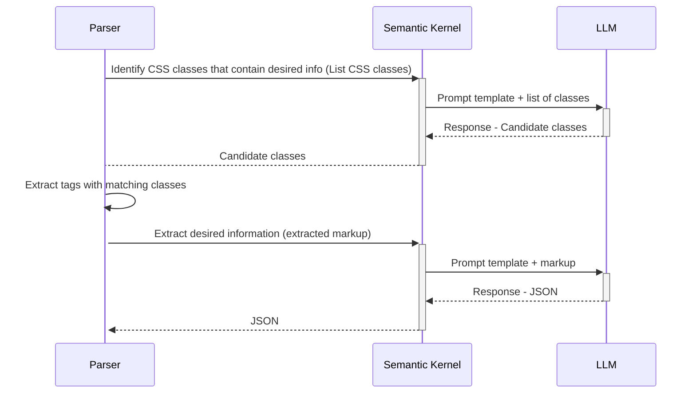

# Concept #
Suppose you were asked to create a web crawler that harvests some standard information (price information for products, player roster information, local/municiple/state ordinances or building codes, etc..) but you needed to capture this across a vast number of sites, each with their own presentation layout. Historically, you would have likely built templates around each class of site or used very complicated RegEx to identify the tags in the page which contained what you were looking for. This works well, but the engineering effort is high both upfront and ongoing as you will need to track failures and adapt to site changes.

This repository represents an experiment designed to determine if one could use an LLM to address some of the complexity and brittleness inherent in traditional designs which address this type of problem. 

